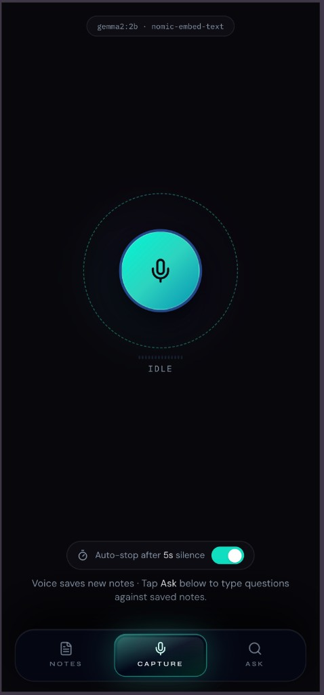
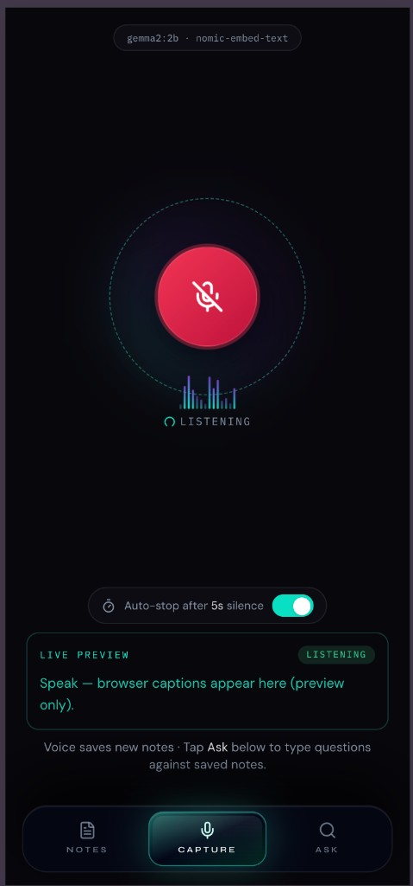

# Private AI Note Keeper

Local voice notes with transcription, categorization, key notes, storage, and memory search. The UI is a Vite React app with shadcn-style components, lucide icons, and lightweight animations.

## Screenshots

Dark, mobile-first **Capture** tab: model status on top, large mic control, optional auto-stop after silence, and live browser speech preview while recording.

<table>
  <tr>
    <td align="center" width="50%">
      <b>Ready to record</b><br/>
      
    </td>
    <td align="center" width="50%">
      <b>Recording + live preview</b><br/>
      
    </td>
  </tr>
</table>

<p align="center">
  <sub>Uses <code>gemma2:2b</code> and <code>nomic-embed-text</code> (shown in-app). Three-tab shell: Notes, Capture, Ask.</sub>
</p>

## Quick Start

Requirements:

- Docker Desktop
- Docker Compose
- Enough disk space for Docker images and local AI models

```bash
docker compose up --build
```

Open:

```text
http://127.0.0.1:3000
```

First boot builds `whisper.cpp`, then downloads the Whisper, chat, and embedding models into Docker volumes. That can take a while.

Copy `.env.example` to `.env` only when you want to change ports, models, or future external-access settings.

## Daily Use

Start the app:

```bash
docker compose up -d
```

Open the UI:

```text
http://127.0.0.1:3000
```

Stop the app:

```bash
docker compose down
```

View logs:

```bash
docker compose logs -f app
docker compose logs -f whisper
docker compose logs -f ollama
```

## If Something Looks Stuck

Check running containers:

```bash
docker compose ps
```

Check the backend health:

```bash
curl http://127.0.0.1:3000/api/health
```

Rebuild only the app after code changes:

```bash
docker compose build app
docker compose up -d app
```

Reset everything, including notes and downloaded models:

```bash
docker compose down -v
```

Use reset only when you really want to delete local data.

## Frontend Development

```bash
cd frontend
npm install
npm run dev
```

The Vite dev server proxies `/api` to the Docker app on `http://127.0.0.1:3000`.

## What It Does

- Records audio in the browser.
- Sends audio to Dockerized `whisper.cpp`.
- Uses Ollama to summarize and categorize the note.
- Stores notes in SQLite.
- Stores note embeddings in Qdrant.
- Lets you ask questions against previous notes.

For a beginner-friendly explanation of these pieces, read:

```text
docs/how-it-works-for-beginners.md
```

## Local-Only Default

The app binds to `127.0.0.1` in Docker Compose. External access is disabled by default. HMAC env values are present in `.env.example` for a later external mode, but v1 is designed for local use.

## Models

Defaults (override in `.env` or Compose):

- Whisper: `small.en` (`WHISPER_MODEL`)
- Chat: `gemma2:2b`
- Embeddings: `nomic-embed-text`

Change these before starting the stack if you want different models.

Only the web app is exposed to the host by default. Ollama, Qdrant, and Whisper stay on Docker's internal network to avoid local port conflicts.
